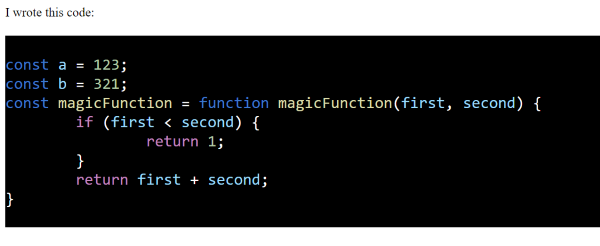

# Html CodeBlocks

Allows easy inserting of code snippets to .html files. Works alone or as a webpack plugin.

## Example

Suppose you have the following looking piece of javascript code

**magic.js**
```js
const a = 123;
const b = 321;
const magicFunction = function magicFunction(first, second) {
    if (first < second) {
        return 1;
    }
    return first + second;
}
```

And you'd want this inserted to your html with proper color coding. With JsCodeBlocks this can be done by just defining an html-like component <htmlcodeblocks-magic.js/> in the .html source file.

**index.html**
```html
<!DOCTYPE HTML>
<html>
    <head>
    </head>
    <body>
        <div>I wrote this code:</div>
        <htmlcodeblocks-magic.js/>
    </body>
</html>
```

HtmlCodeBlocks can then check the index.html for any codeblocks and replace them with the corresponding files. E.g., in this case the resulting html would look like the following in the browser



## How to

### As a webpack plugin

Todo:

### As a standalone

Todo: